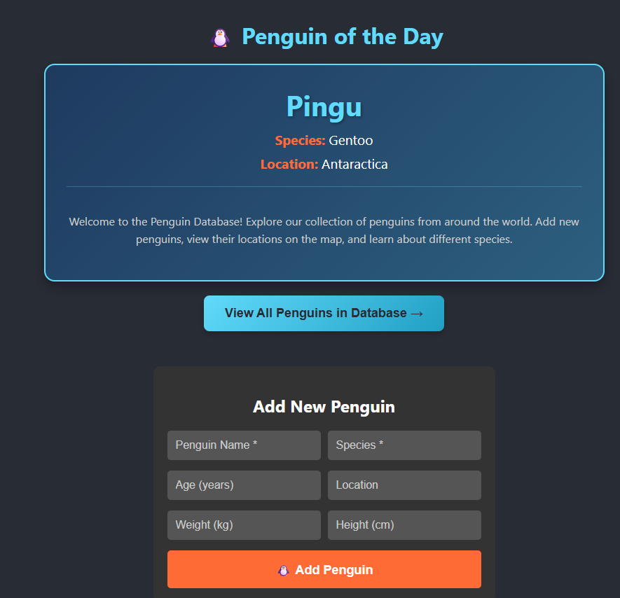
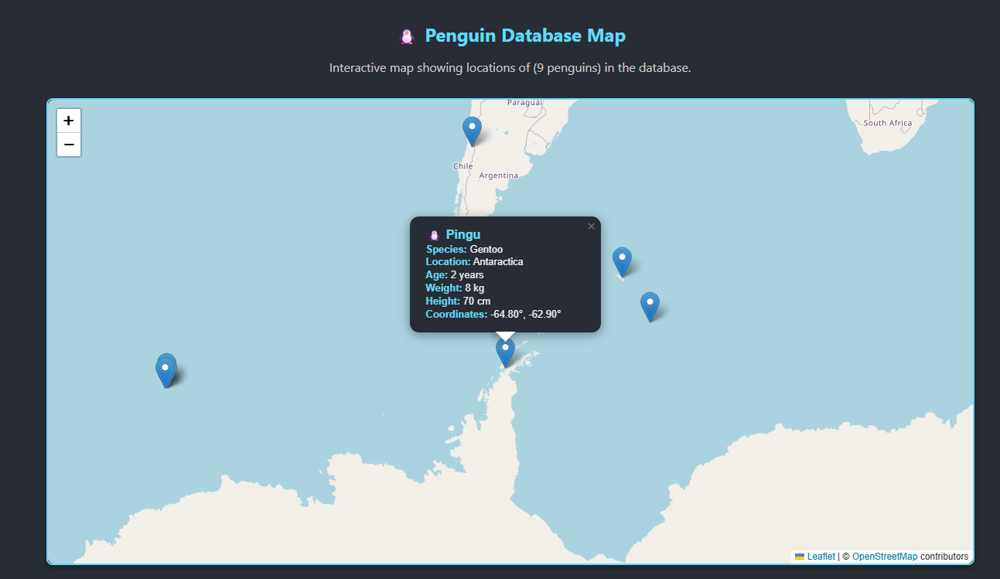

# PenguinDataBase

## What is Penguin Database? 

Penguin Database is a full-stack web application that allows users to enter their unique penguins, visualize them on an interactive map, and serve as an open-source platform for penguin data and information.


## Key Features

- 🐧 **CRUD Operations** - Create, read, update, and delete penguin records
- 🗺️ **Interactive Mapping** - Visualize penguin locations using Leaflet
- 🔍 **Search Functionality** - Find penguins by name or species
- �️ **API Rate Limiting** - Protection against abuse with tiered rate limits
- �📊 **Performance Monitoring** - Real-time request and database query tracking
- 🏥 **Health Monitoring** - Comprehensive system health and metrics endpoints
- ✅ **Input Validation** - Robust data validation and sanitization
- 🧪 **Test Coverage** - Jest unit tests for models


## Technologies Used

### Frontend
- React 19 - UI framework
- React Router - Client-side routing
- Leaflet - Interactive mapping
- JavaScript (ES6+)
- CSS3

### Backend
- Node.js & Express - Server framework
- MongoDB - Database
- RESTful API design

### Architecture
- MVC Pattern
- React Context API for state management
- Performance monitoring middleware
- Error rate tracking
- Database query optimization

### AI Agent
- Github Copilot and Claude

## Getting Started

### Prerequisites
- Node.js (v14 or higher)
- MongoDB (local or Atlas)
- npm or yarn

### Backend Setup

1. Navigate to the backend directory:
   ```bash
   cd PenguinDataBase-Project/backend
   ```

2. Install dependencies:
   ```bash
   npm install
   ```

3. Create a `.env` file with your MongoDB connection string:
   ```env
   MONGODB_URI=mongodb://localhost:27017/penguindb
   PORT=5000
   NODE_ENV=development
   ```

4. Start the server:
   ```bash
   npm start          # Production mode
   npm run dev        # Development mode with auto-restart
   ```

### Frontend Setup

1. Navigate to the frontend directory:
   ```bash
   cd PenguinDataBase-Project/frontend
   ```

2. Install dependencies:
   ```bash
   npm install
   ```

3. Start the development server:
   ```bash
   npm start
   ```

The frontend will run on `http://localhost:3000` and the backend on `http://localhost:5000`.

## API Endpoints

### Penguin Operations
- `GET /api/penguins` - Get all penguins
- `GET /api/penguins/:id` - Get penguin by ID
- `POST /api/penguins` - Create new penguin
- `PUT /api/penguins/:id` - Update penguin
- `DELETE /api/penguins/:id` - Delete penguin
- `GET /api/penguins/search?q=term` - Search penguins
- `GET /api/penguins/stats` - Get database statistics

### Health & Monitoring
- `GET /` - Basic health check
- `GET /api/test` - API functionality test
- `GET /api/db-test` - Database connection test
- `GET /api/health/detailed` - Detailed system health and performance metrics
- `GET /api/health/metrics` - Performance metrics (uptime, memory, error rates)

## Security & Performance Features

### API Rate Limiting

The API implements tiered rate limiting to prevent abuse and ensure fair usage:

**General Limits:**
- All endpoints: 100 requests per 15 minutes per IP

**Read Operations** (GET):
- 60 requests per minute per IP
- Applies to: `/api/penguins`, `/api/penguins/:id`, `/api/penguins/search`, `/api/penguins/stats`

**Write Operations** (PUT/DELETE):
- 20 requests per minute per IP
- Applies to: Update and delete endpoints

**Create Operations** (POST):
- 10 requests per minute per IP
- Strictest limits to prevent spam
- Applies to: `/api/penguins` (create)

**Rate Limit Response:**
When exceeded, you'll receive:
```json
{
  "success": false,
  "message": "Too many requests from this IP, please try again later.",
  "retryAfter": "1 minute"
}
```

Response headers include:
- `RateLimit-Limit`: Request limit per window
- `RateLimit-Remaining`: Remaining requests in current window
- `RateLimit-Reset`: Time when the limit resets

### Performance Monitoring

The application includes built-in performance monitoring:

- **Request Tracking**: Monitors request duration and memory usage
- **Slow Request Detection**: Alerts on requests taking >1s (warning) or >3s (critical)
- **Database Query Monitoring**: Tracks query performance with 100ms threshold
- **Error Rate Tracking**: Real-time error rate calculation over 60s windows
- **System Metrics**: CPU, memory, and uptime tracking

Check metrics at `/api/health/detailed` for comprehensive system status.

## Testing

Run the test suite:
```bash
cd PenguinDataBase-Project/backend
npm test              # Run all tests
npm run test:watch    # Watch mode
npm run test:coverage # With coverage report
```

## Demo

<p align="center">
  
  
  
  
</p>

